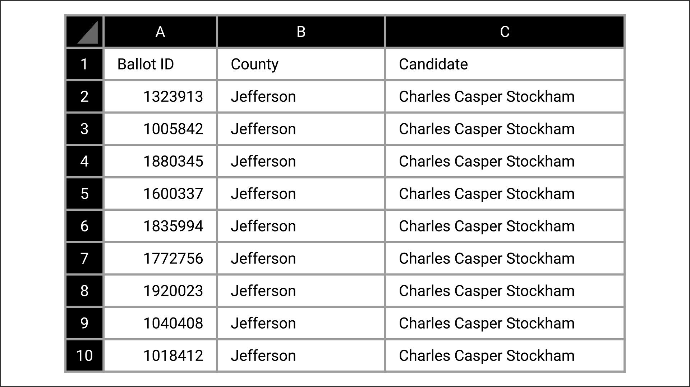

# Election_Analysis

## Project Overview
A Colorado Board of Elections has asked that an audit be completed for a recent congressional election. The board of election has asked that the audit verify the following:

- Total number of votes cast in the election
- A complete list of candidates who received votes
- Total number of votes each candidate received
- Percentage of votes each candidate received
- The winner of the election based on popular vote

The audit will review a data file provided by the board of election. This file contains the following data:

- a number for the ballot ID
- name for the county
- The name of the candidate receiving the vote

## Overview of Solution

The current solution will read in the defined data file.

    # Add a variable to load a file from a path.
	file_to_load = '..\..\Resources\election_results.csv'

The solution will define a data file for the results to be printed in.
    # Add a variable to save the file to a path.
	file_to_save = '..\..\Analysis\election_analysis.txt'

The solution will read through the data file row by row to analyze each vote. Part of the analyziz is to count all of the votes.

    # For each row in the CSV file.
    for row in reader:

        # Add to the total vote count
        total_votes = total_votes + 1

The solution will determine all of the candidates in the election and how many votes each received.

    # If the candidate does not match any existing candidate add it to
    # the candidate list
       if candidate_name not in candidate_options:

          # Add the candidate name to the candidate list.
          candidate_options.append(candidate_name)

          # And begin tracking that candidate's voter count.
          candidate_votes[candidate_name] = 0

      # Add a vote to that candidate's count
      candidate_votes[candidate_name] += 1

The solution will also determine the number of votes cast in each county 

       # 4a: Write an if statement that checks that the
       # county does not match any existing county in the county list.
       if county_name not in county_options:

           # 4b: Add the existing county to the list of counties.
           county_options.append(county_name)

           # 4c: Begin tracking the county's vote count.
           county_votes[county_name] = 0

        # 5: Add a vote to that county's vote count.
        county_votes[county_name] += 1

The solution will determine which county had the highest voter turn and print the number of voters which turned out.

	# 6a: Write a for loop to get the county from the county dictionary.

    for county_name in county_options:

                
        # 6f: Write an if statement to determine the winning county and get its vote count.
        # Determine winning vote count, winning percentage, and candidate.
        if votes > largest_county_vote:
            largest_county_vote = votes
            largest_county_percent = vote_percentage
            largest_county = county_name

    # 7: Print the county with the largest turnout to the terminal.
    winning_county_summary = (
        f"-------------------------\n"
        f"Largest County: {largest_county}\n"
        f"County Vote Count: {largest_county_vote:,}\n"
        f"County Vote percentage of total: {largest_county_percent:.1f}%\n"
        f"-------------------------\n")
    print(winning_county_summary)
 
The solution will determine which candidate had the highest vote count.

	for candidate_name in candidate_votes:

        # Determine winning vote count, winning percentage, and candidate.
        if (votes > winning_count) and (vote_percentage > winning_percentage):
            winning_count = votes
            winning_candidate = candidate_name
            winning_percentage = vote_percentage

    # Print the winning candidate (to terminal)
    winning_candidate_summary = (
        f"-------------------------\n"
        f"Winner: {winning_candidate}\n"
        f"Winning Vote Count: {winning_count:,}\n"
        f"Winning Percentage: {winning_percentage:.1f}%\n"
        f"-------------------------\n")
    print(winning_candidate_summary)

The solution will produce a report on the screen and in the defined report text file which reports the results of election.

## Summary of Results

The audit found that there were **369,711 total votes** cast in the congressional precinct. 

The precinct consisted of the following counties: 

<table>
<tr>
<th>County</th>
<th>Percent of votes cast</th>
<th>Count of votes cast</th>
<th>Largest County to Vote</th>
</tr>
<tr>
<td>Jefferson</td>
<td>10.5%</td>
<td>38,855</td>
<td></td>
</tr>
<tr>
<td>Denver</td>
<td>82.8%</td>
<td>306,055</td>
<td>&#10004</td>
</tr>
<tr>
<td>Arapahoe</td>
<td>6.7%</td>
<td>24,801</td>
<td></td>
</tr>
</table>

The audit found the following candidates received votes in the audited election:

<table>
<tr>
<th>Candidate </th>
<th>Percent of votes cast</th>
<th>Count of votes cast</th>
<th>Winner of Vote</th>
</tr>
<tr>
<td>Charles Casper Stockham</td>
<td>23.0%</td>
<td>85,213</td>
<td></td>
</tr>
<tr>
<td>Diana DeGette</td>
<td>73.8%</td>
<td>272,892</td>
<td>&#10004</td>
</tr>
<tr>
<td>Raymon Anthony Doane</td>
<td>3.1%</td>
<td>11,606</td>
<td></td>
</tr>
</table>

## Audit Summary

The solution utilized for this audit was built specifically for the Colorado congressional election. The solution built for the Colorado congressional election is generic enough that with a couple of easy changes it could work for any election.

<ol>
<li>One easy way this solution could be improved is to utilize a file selection utility. Currently the solution has the input file hard coded into the solution. With a change in the solution from  a coded value of Resources\election_results.csv to utilizing a askopenfilename command to open a windows file dialog and allow the user to identify the file to be process. As long as the selected file was in the identified election format the data could be analyzed, audited, and reported.</li>
<li>A change that would be a little more work would be to change the scope of the solution. The current solution was built with a very limited scope. A single race for a single congressional seat. The current  could data file contains the following fields:
<ul>
<li>a number for the ballot ID</li>
<li>name for the county</li>
<li>The name of the candidate receiving the vote</li>
</ul>
There are a couple of ways the scope of the solution could be changed:
<ul>
<li>The scope could grow to process a national race, but keep the solution processing a single file per race
<ul>
<li>This solution would work for any state level election. It would not work for a national level election, like president or vice president. If we kept the solution to be a single file for a single race, but allowed that race to be a national race like for the president or vice president. If another column were added to the data file for state, and some analysis of the state data column added to the solution, this solution could be utilized to audit just about any election from city mayor all the way up to president. The new data file would like:
<ul>
<li>a number for the ballot ID</li>
<li>name for the county</li>
<li>The name of the candidate receiving the vote</li>
<li>State where the vote was cast</li>
</ul>
</ul>
<li>The scope could grow to allow multiple races per file, but within a single state
<ul>
<li>The other change which could be made to this solution is to support multiple races per file. The current  solution assumes a data file per race. If a field for race were added to the data file, and some analysis which would analyze the race data. This solution could much more useful. The new data file would look like:
<ul>
<li>a number for the ballot ID</li>
<li>name for the county</li>
<li>The name of the candidate receiving the vote</li>
<li>Race the vote is being cast for</li>
</ul>
</ul>
<li>The scope could grow to allow multiple races across states, and include national races in a single file
<ul>
<li>If we combine these two suggestions and build a solution that can take a national data file with all votes cast. The data file would have to include the addition of both of the fields mentioned previously, a state field and a race field. resulting in a new data file looking like:
<ul>
<li>a number for the ballot ID</li>
<li>name for the county</li>
<li>The name of the candidate receiving the vote</li>
<li>Race the vote is being cast for</li>
<li>State where the vote was cast</li>
</ul>
</ul>
</ul>
</ol>

